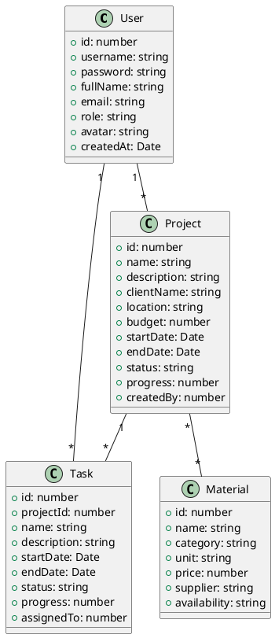
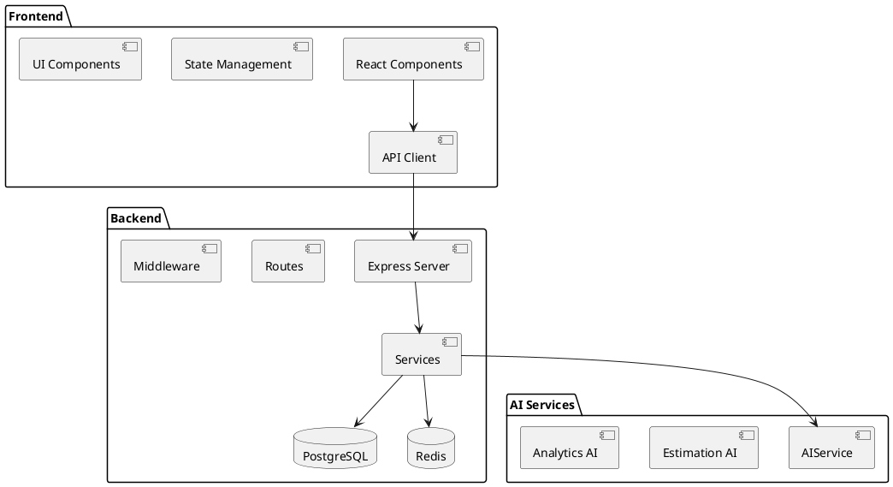
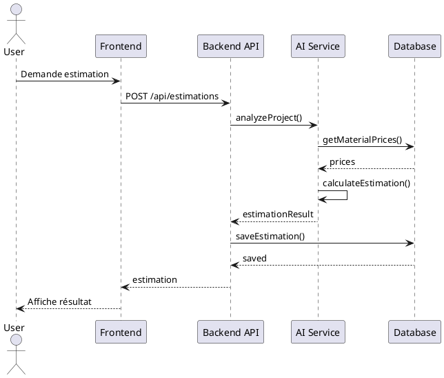
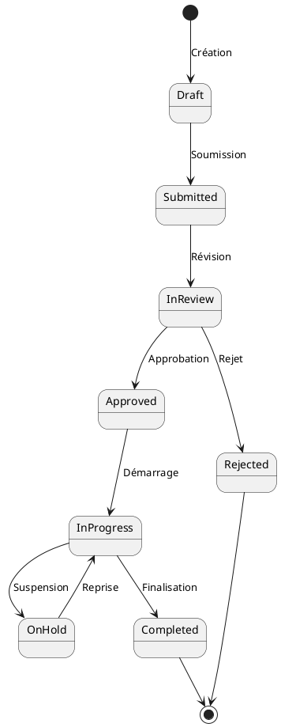
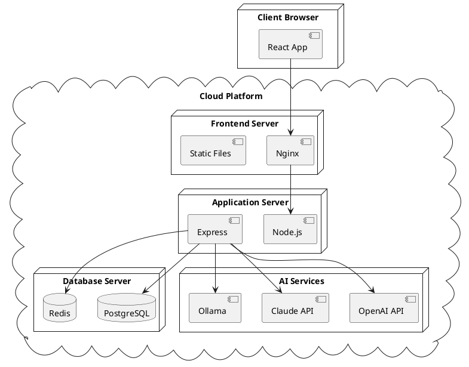
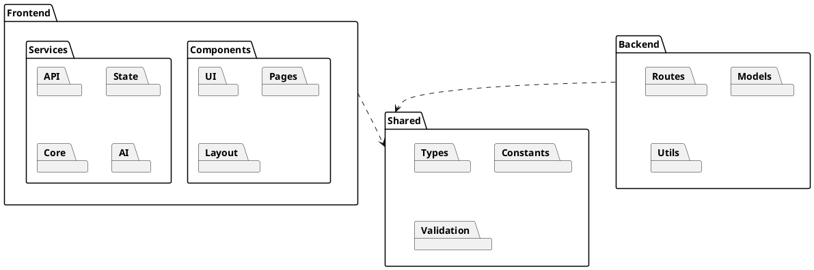
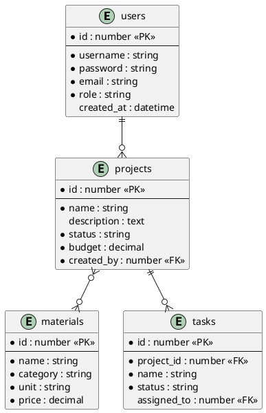
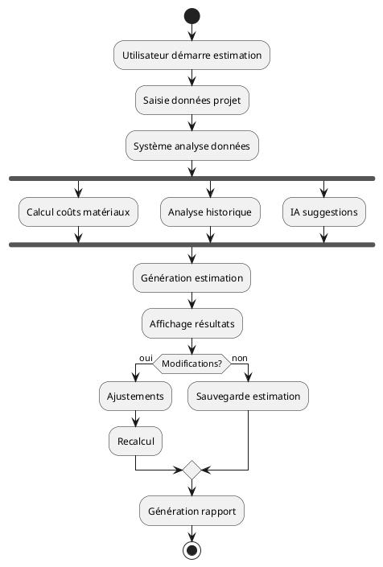
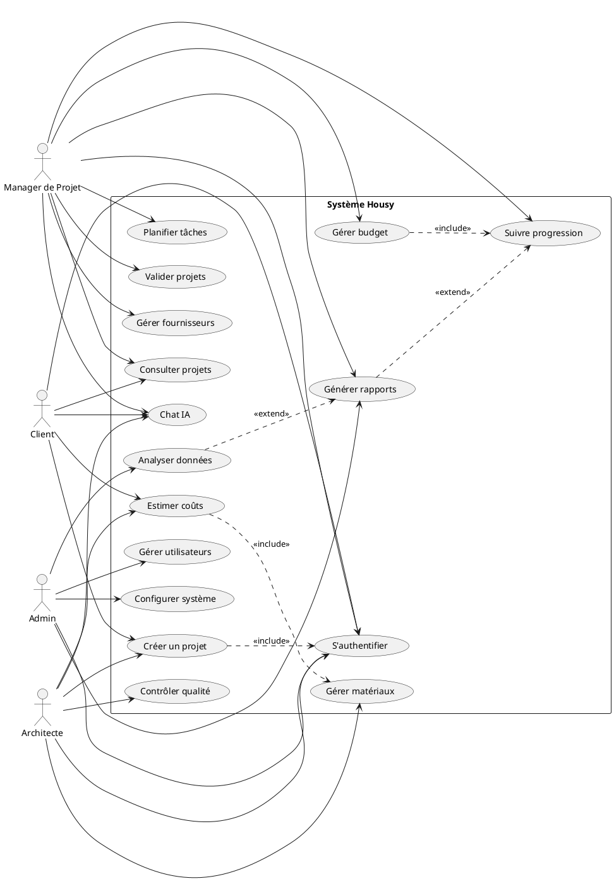
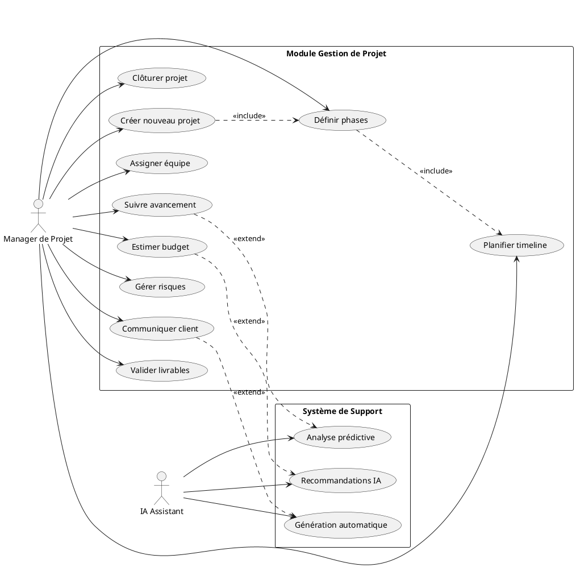

# Diagrammes UML de l'Architecture Housy

## 1. Diagramme de Classes

### Entités Principales

## 2. Diagramme de Composants

## 3. Diagramme de Séquence (Exemple pour Estimation)

## 4. Diagramme d'États (Projet)

## 5. Diagramme de Déploiement

## 6. Diagramme de Paquetages

## 7. Diagramme ER Base de Données

## 8. Diagramme d'Activité (Workflow d'Estimation)

## 9. Diagramme de Cas d'Utilisation

## 10. Diagramme de Cas d'Utilisation Détaillé (Gestion de Projet)

